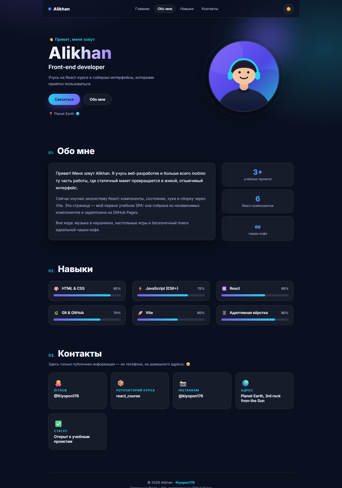

# About Me — React SPA

Учебное задание: одностраничное приложение-визитка на React.

- **Репозиторий:** https://github.com/Kiyopon176/react_course
- **Деплой (GitHub Pages):** https://kiyopon176.github.io/react_course/



## Что внутри

| Требование | Как выполнено |
| --- | --- |
| Имя и изображение | Секция `Hero` — имя и SVG-аватар |
| About Me | Секция `About` — текст о себе + статистика |
| Контакты (без приватных данных) | Секция `Contacts` — GitHub, репозиторий, Instagram, «Planet Earth», статус |
| Минимум 3 React-компонента | 6 компонентов: `Navbar`, `Hero`, `About`, `Skills`, `Contacts`, `Footer` |
| CSS-стилизация | Градиенты, glassmorphism, анимации, тёмная/светлая тема, адаптив |
| Деплой | GitHub Pages, ветка `gh-pages` |

Приватных данных нет: ни телефона, ни домашнего адреса, ни личной почты.

## Стек

React 18, Vite 6, обычный CSS (по одному файлу стилей на компонент).

## Структура

```
src/
├── App.jsx              # состояние темы + подсветка активной секции (useState/useEffect)
├── main.jsx
├── index.css            # CSS-переменные, темы, общие стили
├── data/profile.js      # все личные данные в одном месте
└── components/
    ├── Navbar.jsx       # навигация + переключатель темы
    ├── Hero.jsx         # имя, роль, аватар
    ├── About.jsx        # «обо мне» + статистика
    ├── Skills.jsx       # навыки с прогресс-барами
    ├── Contacts.jsx     # карточки контактов
    └── Footer.jsx
```

## Локальный запуск

```bash
npm install
npm run dev        # http://localhost:5173/react_course/
npm run build      # production-сборка в dist/
npm run preview    # посмотреть собранную версию
```

## Деплой

```bash
npm run deploy     # build + публикация dist/ в ветку gh-pages
```

`base` в [vite.config.js](./vite.config.js) должен совпадать с именем репозитория (`/react_course/`),
иначе на GitHub Pages не подгрузятся CSS и JS.

## Как поменять данные под себя

Все тексты, ссылки и навыки лежат в [src/data/profile.js](./src/data/profile.js) — правится только этот файл.
